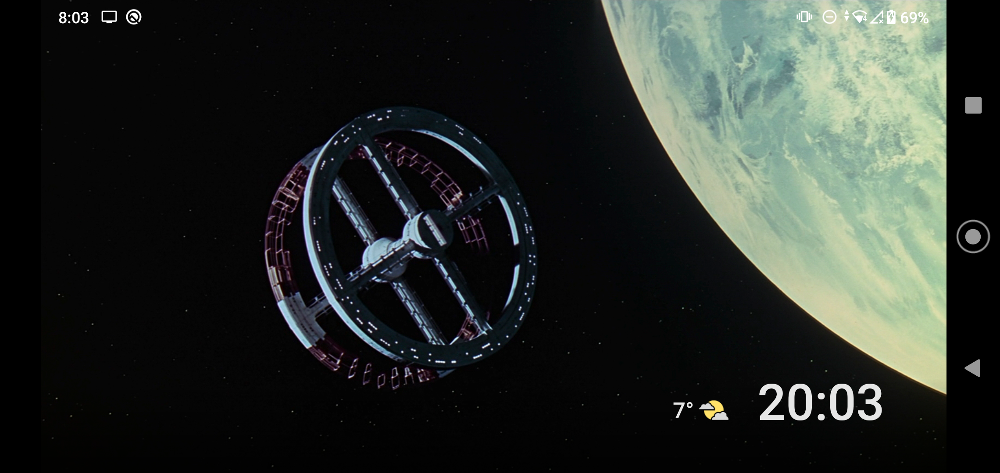

# Ambient TV

A simple react-native app to cycle background images (works great on [Chromecast with Google TV](https://store.google.com/gb/product/chromecast_google_tv))



## Features

- Clock
- Live weather by location
- New background every 2 minutes
- Avoids using the same background twice for RSS feeds

## Development

### Env

For now, the `.env` file is **_required_** to build.

There are two image fetch methods: [`unsplash`](https://unsplash.com), or a custom `RSS` feed

1. Choose a feed method
2. Duplicate `.env.sample` as `.env`
3. Either get an [unsplash API](https://unsplash.com/developers) key or use an RSS feed consisting of images

```
app/.env

UNSPLASH_API_KEY=
RSS_DEFAULT_URL=
FETCH_METHOD=rss/unsplash
```

## License

[Apache-2.0 License](LICENSE)
